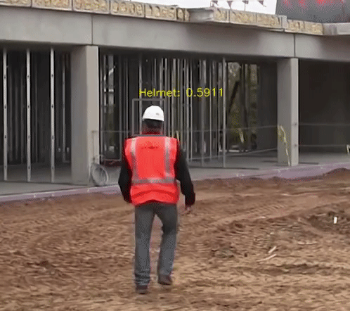
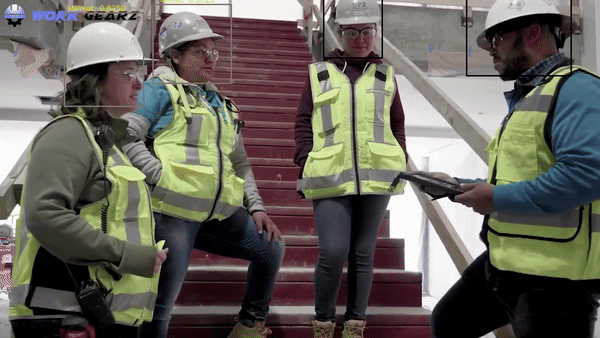

## Safety Equipment Detection

A simple computer vision based project to detect if person is wearing an helmet or not as part of the 
[Wobot Hackathon 4.0](https://wobot.ai/blog/wobot-hackathon-4-0/)

  
The Dataset was provided by them and can be accessed from the hackathon page

 
I have used YoloV3 in order to implement this and since the provided dataset was
in pascal_voc format, initial step was to convert to Yolo format using python script. For the 
submission, I converted yolo annotation to pascal_voc using another script

We were asked to use our trained model to detect from a video. The results looked something like this

 
